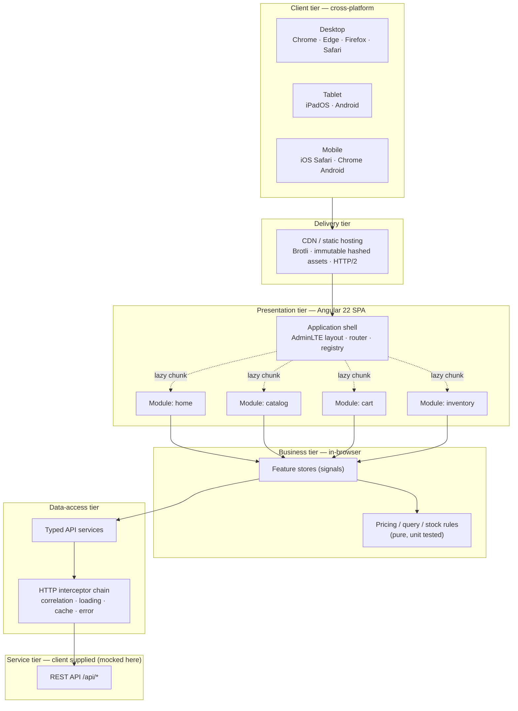
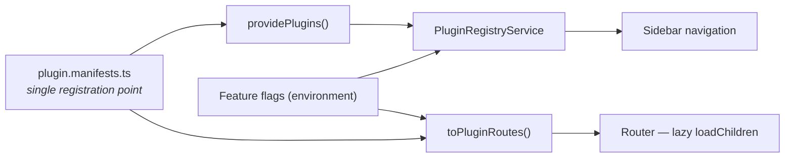

# RIMMS — Solution Approach

**Retail Inventory Management Software System · YCompany · Frontend Solution**
Version 1.0 · Angular 22 + AdminLTE 4

---

## 1. Technical Diagram

**Tier boundaries are enforced by dependency direction:** components may depend on stores,
stores on services, services on the HTTP layer. Nothing depends upwards, and no component
ever injects `HttpClient` directly.

---

## 2. Solution Architecture

### 2.1 Pluggable module architecture

The shell has no knowledge of any feature. Each functional module publishes a
`PluginManifest` and the shell derives everything else from it.

| Concern | Mechanism |
| --- | --- |
| Registration | One entry in `src/app/plugins/plugin.manifests.ts` |
| Isolation | Module owns its routes, components, store and styles |
| Loading | `loadChildren` → separate bundle, fetched on first navigation |
| Navigation | Generated from the registry — no shell edits |
| Enable / disable | `requiredFlags` checked against `FeatureFlags`; a disabled module emits no route, so its bundle is never requested |
| Runtime extension | `PluginRegistryService.register()` for manifests delivered late |

**Adding a module = create a folder + add one manifest entry.** No shell, routing or
navigation code changes.

### 2.2 Layer responsibilities

| Layer | Location | Responsibility |
| --- | --- | --- |
| Shell / layout | `src/app/layout` | AdminLTE chrome, theme, responsive sidebar, toasts, progress |
| Plugin core | `src/app/core/plugin` | Manifest contract, registry, route projection |
| Feature modules | `src/app/features/*` | Screens + feature stores; independently deployable units |
| Business rules | `catalog-query.ts`, `cart.service.ts`, `pagination.component.ts` | Pure functions — framework-free and fully unit tested |
| Data access | `src/app/core/services` | Typed services, one per bounded context |
| Cross-cutting | `src/app/core/interceptors` | Correlation ids, logging, caching, loading, error normalisation |
| Shared UI | `src/app/shared` | Presentational, input/output-only components |

### 2.3 Key design principles applied

- **Single responsibility / separation of concerns** — component ↔ store ↔ service ↔ transport.
- **Open–closed** — new modules extend the app without modifying the shell.
- **Dependency inversion** — configuration and logging injected via `APP_CONFIG` / `LoggerService`.
- **Don't repeat yourself** — one query-serialisation contract, one pricing engine, one SEO surface.
- **Immutability** — signals plus pure reducers; no in-place mutation of state.
- **Composition over inheritance** — standalone components, no base-class hierarchies.

---

## 3. Non-Functional Requirements Coverage

| NFR | Implementation | Evidence |
| --- | --- | --- |
| **Cross-platform** (desktop / tablet / mobile) | Responsive Bootstrap 5 grid; AdminLTE off-canvas sidebar below 992px; `viewport-fit=cover`; touch-sized targets | Every screen uses `row-cols-*` breakpoints; `LayoutService` switches to overlay mode on mobile |
| **Cross-browser** (Chrome, Edge, Firefox, Safari macOS/iOS) | ES2022 build targeted at the last 2 versions of each browser; no vendor-specific APIs; logical CSS properties; `browserslist` defaults | Standard Angular differential output; feature detection guards `localStorage` and `matchMedia` |
| **Response within 100 ms** | Zoneless change detection with `OnPush`; signal-based state; global progress bar starts on the first byte of any request; skeleton placeholders instead of blank regions; 250 ms debounce + `switchMap` on search | `LoadingService` + `loadingInterceptor`; `CardSkeletonComponent`; typeahead in the header |
| **Initial load** (was > 60 s) | Route-level code splitting; initial payload ≈ **166 kB** transferred (gzip); vendor CSS shipped once; product photography is lazy-loaded, CDN-resized and backed by an inline SVG placeholder; idle-time preloading of feature chunks | `ng build` output; `withPreloading(PreloadAllModules)` |
| **Fast product search** | Server-side pagination + faceting; only 12 cards rendered per page; short-lived HTTP cache for facets/offers; cancelled in-flight requests | `CatalogStore`, `cacheInterceptor` |
| **SEO** | Per-route title/description/canonical, Open Graph, JSON-LD `Product` and `OnlineStore` schema, semantic landmarks and heading order, descriptive `alt` text, crawlable filter URLs | `SeoService`, `index.html` |
| **Trend-ready / scalable** | Pluggable modules, design tokens as CSS custom properties, standalone components, no NgModules | `PluginManifest`, `styles.scss` |
| **Latest technology** | Angular 22 (standalone, signals, zoneless), Bootstrap 5.3, AdminLTE 4.9, TypeScript strict, Vitest | `package.json` |
| **Logging** | Correlation id on every request, level-filtered structured logger, normalised error envelopes | `LoggerService`, `correlationLoggingInterceptor` |
| **Accessibility** | Visible focus rings, ARIA labels on icon-only controls, live regions for toasts, `prefers-reduced-motion` honoured | Global styles + component templates |
| **Unit testability** | Business rules extracted as pure functions; DI-provided config; 38 tests across 5 suites | `npm run test:ci` |
| **CI** | Lint → test → production build on every push and pull request | `.github/workflows/ci.yml` |

---

## 4. Performance

### 4.1 Budget and measured results

| Metric | Target | Achieved (production build) |
| --- | --- | --- |
| Initial JS transferred | < 200 kB | ~121 kB gzip |
| Initial CSS transferred | < 60 kB | ~45 kB gzip |
| Total initial payload | < 250 kB | **~166 kB gzip** |
| Largest feature chunk | < 10 kB | 3.9 kB gzip (product search) |
| Interaction feedback | < 100 ms | Progress bar and skeletons render on the same frame as the click |

### 4.2 Techniques applied

1. **Code splitting per module** — the shell downloads only what the first route needs.
2. **Idle preloading** — remaining feature chunks are fetched after first paint, so subsequent navigation has no network cost.
3. **Zoneless change detection** — no `zone.js` monkey-patching; Angular re-renders only the components whose signals changed.
4. **`OnPush` everywhere** — every component in the application declares it explicitly.
5. **Request hygiene** — debounce + `switchMap` guarantee one in-flight search; `cacheInterceptor` serves repeat facet/offer reads from memory.
6. **Server-side pagination** — the DOM never holds more than one page of cards.
7. **Zero layout shift** — fixed `aspect-ratio` media boxes, reserved scrollbar gutter, skeletons matching final dimensions.
8. **Resilient imagery** — real photography requested at the exact rendered size with `loading="lazy"`; a deterministic inline SVG sits behind every tile, so a slow or failed image never shows a broken state.
9. **Budget enforcement** — `ng build` fails the pipeline if the initial bundle regresses past 1.5 MB raw.

### 4.3 Recommended next steps for production

- Enable SSR/SSG (`@angular/ssr`) for crawler-perfect HTML and a faster LCP.
- Serve client-owned product imagery as AVIF/WebP through `NgOptimizedImage` with `priority` on the hero.
- Add a service worker for offline browsing of the last-viewed catalogue page.
- Wire real-user monitoring (Core Web Vitals) into the existing `LoggerService` transport.

---

## 5. Assumptions & Scope

### 5.1 Assumptions

1. The client supplies production REST APIs; the contract mirrors the mock API in `mock-api/`.
2. Authentication, authorisation and payment processing are handled by existing YCompany platforms.
3. Product imagery, copy and pricing are supplied by the client's PIM; placeholders are used here.
4. Single locale (en-IN) and single currency (INR) for release 1; i18n is architecturally allowed for.
5. Browser support is the last two versions of Chrome, Edge, Firefox and Safari.
6. Hosting is static (CDN) with a reverse proxy fronting `/api`.

### 5.2 In scope

- Angular application shell with AdminLTE 4 responsive layout and light/dark themes.
- Pluggable module architecture with feature-flag gating and lazy loading.
- Home / storefront landing screen with offers, categories and featured products.
- Product **search** screen: full-text search, faceted filters, sorting, pagination, deep-linkable URLs.
- Product **showcase** (detail) screen: variants, live stock, related products, JSON-LD.
- Sample operational task: **stock control** module with KPIs, filtering and SKU adjustments.
- Basket with pricing rules and order placement.
- Cross-cutting concerns: logging, correlation ids, caching, error handling, SEO, notifications.
- Mock Node.js API and unit test suite; CI pipeline definition.

### 5.3 Out of scope

- Backend implementation, persistence and integrations (ERP, PIM, payments, tax, shipping).
- Real authentication, user accounts, saved addresses and order history beyond the demo endpoint.
- Payment gateway, invoicing and returns processing.
- Server-side rendering, PWA/offline mode and push notifications.
- Content management, marketing automation, A/B testing and analytics tooling.
- Multi-language, multi-currency and multi-region storefronts.
- End-to-end and visual-regression automation (unit testing only for this sample).
