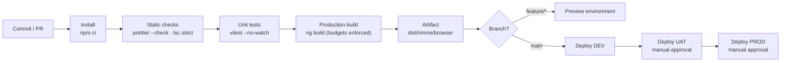

# RIMMS — Build & Release Strategy (one page)

## Pipeline



## Stages

| # | Stage | Command | Gate |
| --- | --- | --- | --- |
| 1 | Install | `npm ci` | Lockfile must be reproducible |
| 2 | Format | `npm run lint:format` | Prettier clean |
| 3 | Type check + tests | `npm run test:ci` | 100% suites green; business-layer coverage required |
| 4 | Build | `npm run build` | Bundle budgets not exceeded; zero compiler errors |
| 5 | Package | Upload `dist/rimms/browser` | Immutable, content-hashed filenames |
| 6 | Deploy | Static upload + CDN invalidation | Manual approval for UAT and PROD |

## Build configuration

- **Environments** — `src/environments/environment.ts` is swapped for `environment.production.ts` at build time via `fileReplacements`. API base URL, log level, page size and feature flags are all environment-driven; changing a feature flag requires a new build.
- **Optimisation** — production builds apply AOT, tree-shaking, minification, CSS optimisation, license extraction and `outputHashing: all`.
- **Budgets** — the initial bundle is capped (warn 1.1 MB / error 1.5 MB raw). A regression fails the pipeline rather than reaching users.
- **Source maps** — generated for development; disabled for production output and uploaded separately to the error-tracking service.

## Local development

```bash
npm install
npm start           # mock API (:3000) + dev server (:4200) together
npm run test        # vitest in watch mode
npm run build       # production bundle
```

The development environment connects directly to the mock GraphQL API at
`http://localhost:3000/api`. Production uses the deployed `/api` base URL, which is resolved by
the hosting platform's API routing.

## Branching & versioning

- Trunk-based: short-lived `feature/*` branches merged into `main` via pull request.
- Every PR runs the full pipeline; merge is blocked on a red build.
- Semantic versioning on `main`; each module carries its own `version` in its manifest so
  module-level changes are traceable in release notes.

## Rollback

Artifacts are immutable and content-hashed. Rollback is a CDN pointer switch to the previous
build — no rebuild, no database migration, typically under a minute.

## Quality gates summary

| Gate | Tool | Blocking |
| --- | --- | --- |
| Formatting | Prettier | Yes |
| Type safety | TypeScript strict + Angular strict templates | Yes |
| Unit tests | Vitest + Angular TestBed | Yes |
| Bundle size | Angular CLI budgets | Yes |
| Accessibility & Lighthouse | Manual per release | Advisory |
